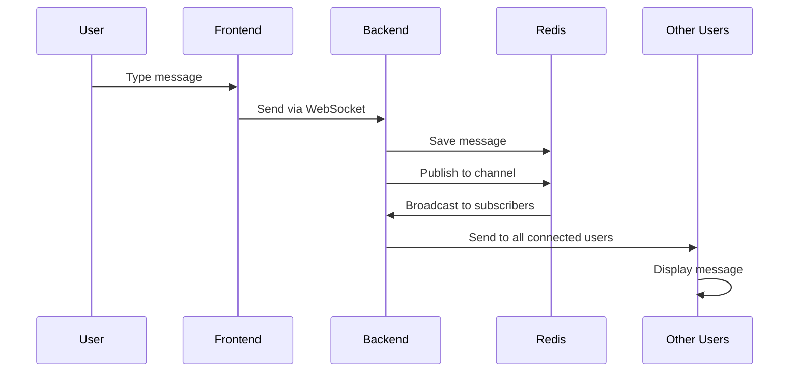

# 🚀 Real-Time Chat Application

**A modern, full-stack real-time chat application built with FastAPI, WebSockets, Redis, and vanilla JavaScript.**

   

## ✨ Features

- 💬 **Real-time messaging** with WebSocket connections
- 👥 **Multi-user support** with online status tracking
- 📱 **Modern UI** with WhatsApp-like design
- 🔊 **Voice messages** and image sharing
- ⌨️ **Typing indicators** for better UX
- 📚 **Message history** persistence with Redis
- 🔄 **Auto-reconnection** on connection loss
- 🎨 **Responsive design** for all devices
- 📡 **REST API** for integration
- 🔍 **Interactive API docs** with Swagger

## 🚀 Quick Start

### One-Command Setup
```bash
./start_app.sh
```

This script will:
- ✅ Check all prerequisites
- 🔴 Start Redis server
- 🐍 Setup Python environment
- 📦 Install dependencies
- 🚀 Launch FastAPI backend
- 🌐 Open frontend in browser

### Manual Setup

1. **Install Redis**
   ```bash
   # Ubuntu/Debian
   sudo apt install redis-server
   
   # macOS
   brew install redis
   
   # Windows - Install Memurai
   # Download from: https://www.memurai.com/
   ```

2. **Start Redis**
   ```bash
   redis-server
   ```

3. **Setup Backend**
   ```bash
   cd backend
   python3 -m venv venv
   source venv/bin/activate  # On Windows: venv\Scripts\activate
   pip install -r requirements.txt
   ```

4. **Start FastAPI Server**
   ```bash
   uvicorn main:app --reload --host 0.0.0.0 --port 8000
   ```

5. **Open Frontend**
   ```bash
   # Open frontend/index.html in your browser
   # Or serve with a local server:
   cd frontend
   python3 -m http.server 3000
   ```

## 📦 PROJECT STRUCTURE

```
Real-Time-Chat-App/
│
├── 🔧 backend/                 # FastAPI Backend
│   ├── main.py                 # FastAPI app with WebSocket endpoints
│   ├── requirements.txt        # Python dependencies
│   │
│   ├── models/                 # Pydantic models
│   │   └── message.py          # Message & user schemas
│   │
│   └── services/               # Business logic
│       ├── chat_service.py     # Message handling & Redis ops
│       └── user_service.py     # User session management
│
├── 🌐 frontend/                # Frontend (Vanilla JS)
│   ├── index.html              # Main HTML with modern UI
│   ├── app.js                  # WebSocket client & UI logic
│   └── style.css               # WhatsApp-like styling
│
├── 🔴 redis/                   # Redis Integration
│   ├── redis_client.py         # Redis connection setup
│   ├── publisher.py            # Publish messages to channels
│   ├── subscriber.py           # Subscribe to message channels
│   └── message_model.py        # Message structure definition
│
├── 📚 Documentation
│   ├── README.md               # This file
│   ├── API_DOCUMENTATION.md    # Complete API reference
│   └── setup_instructions.txt  # Detailed setup guide
│
├── 🚀 Scripts
│   ├── start_app.sh            # One-command startup script
│   └── setup.sh                # Environment setup
│
└── 📋 Config
    ├── .gitignore              # Git ignore rules
    └── logs/                   # Application logs
```

## 🏗️ ARCHITECTURE OVERVIEW

The application follows a **3-tier architecture** for scalability and maintainability:

### 🌐 **Frontend Layer** (Vanilla JavaScript)

**Responsibilities:**
- 🔌 WebSocket connection management
- 💬 Real-time message display
- ⌨️ Typing indicators
- 👥 User interface & interactions
- 📱 Responsive design

**Key Features:**
- Modern WhatsApp-like UI
- Voice message recording
- Image sharing support
- Auto-reconnection on disconnect
- Typing status indicators
- Online user list

### 🔧 **Backend Layer** (FastAPI + WebSocket)

**Responsibilities:**
- 🔌 WebSocket connection handling
- 📡 Real-time message broadcasting
- 💾 Message persistence
- 👥 User session management
- 🔄 Pub/Sub coordination

**API Endpoints:**
- `ws://localhost:8000/ws/chat` - WebSocket connection
- `GET /api/chat/history/{channel}` - Message history
- `GET /api/users/online/{channel}` - Online users
- `POST /api/chat/message` - Send message (REST)
- `GET /docs` - Interactive API documentation

### 🔴 **Data Layer** (Redis)

**Responsibilities:**
- 💾 Message persistence (30-day retention)
- 🔄 Pub/Sub message broadcasting
- 👥 User session storage
- ⌨️ Typing indicator management
- 🚀 High-performance in-memory operations

**Data Structures:**
- `chat:{channel}:messages` - Message history (List)
- `user:{username}:status` - User status (String)
- `channel:{channel}:users` - Online users (Set)
- `typing:{channel}:{username}` - Typing indicators (String)

## 🔄 **Message Flow**



## 🌐 **API Endpoints**

| Method | Endpoint | Description |
|--------|----------|-------------|
| `WS` | `/ws/chat` | WebSocket connection |
| `GET` | `/api/chat/history/{channel}` | Get message history |
| `GET` | `/api/users/online/{channel}` | Get online users |
| `GET` | `/api/chat/channels` | Get active channels |
| `POST` | `/api/chat/message` | Send message (REST) |
| `DELETE` | `/api/chat/message/{id}` | Delete message |
| `GET` | `/docs` | API documentation |

## 🧪 **Testing**

### Test WebSocket Connection
```javascript
const ws = new WebSocket('ws://localhost:8000/ws/chat?username=testuser');
ws.onmessage = (event) => console.log(JSON.parse(event.data));
ws.send(JSON.stringify({type: 'message', content: 'Hello!'}));
```

### Test REST API
```bash
# Get chat history
curl http://localhost:8000/api/chat/history/general

# Send message
curl -X POST http://localhost:8000/api/chat/message \
  -H "Content-Type: application/json" \
  -d '{"sender":"test","content":"Hello!","channel":"general"}'
```

## 📊 **Monitoring**

- **Backend Health**: `http://localhost:8000/`
- **API Docs**: `http://localhost:8000/docs`
- **Redis Status**: `redis-cli ping`
- **Logs**: `tail -f logs/backend.log`

## 🔧 **Configuration**

### Environment Variables
```bash
REDIS_HOST=localhost
REDIS_PORT=6379
API_HOST=0.0.0.0
API_PORT=8000
```

### Redis Configuration
```bash
# Default settings work for development
# For production, consider:
# - Password authentication
# - Persistence configuration
# - Memory optimization
```

## 🚀 **Deployment**

### Docker (Recommended)
```dockerfile
# Create Dockerfile for easy deployment
# Use docker-compose for multi-service setup
```

### Manual Deployment
1. Setup Redis server
2. Deploy FastAPI with gunicorn
3. Serve frontend with nginx
4. Configure reverse proxy

## 🤝 **Contributing**

1. Fork the repository
2. Create feature branch: `git checkout -b feature-name`
3. Commit changes: `git commit -am 'Add feature'`
4. Push to branch: `git push origin feature-name`
5. Submit pull request

## 📝 **License**

MIT License - see LICENSE file for details

## 🆘 **Troubleshooting**

### Common Issues

**Connection Failed**
- ✅ Check Redis is running: `redis-cli ping`
- ✅ Check FastAPI is running: `curl http://localhost:8000`
- ✅ Check ports 6379 and 8000 are not blocked

**Messages Not Appearing**
- ✅ Check browser console for WebSocket errors
- ✅ Verify username is set correctly
- ✅ Check backend logs: `tail -f logs/backend.log`

**Performance Issues**
- ✅ Monitor Redis memory usage
- ✅ Check message history limits
- ✅ Consider Redis optimization

### Getting Help

- 📖 Check [API Documentation](API_DOCUMENTATION.md)
- 🐛 Report issues on GitHub
- 💬 Join our community chat

---

**Built with ❤️ using FastAPI, Redis, and modern web technologies**
